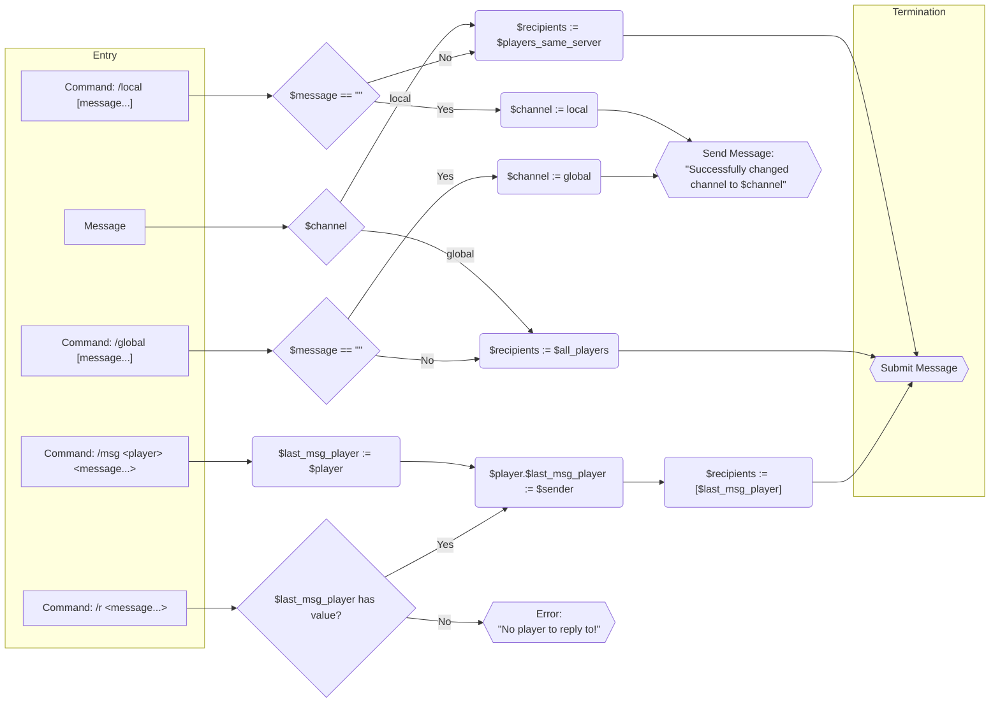

# AuraChat

A flow based Minecraft chat plugin.

## Concept

The core idea is that every incoming message or chat command gets processed through a flow diagram that's editable by
the server admins.

### Nodes

There are 3 types of nodes, each with a set of subtypes:

- Entry Nodes: These are the nodes where the flow of a message starts.
    - Chat Node: This node can only exist once and represents when a player sends a normal message.
    - Command Nodes: One node per command. Commands can allow additional arguments, like players or capture the rest as
      the message.
- Processing Nodes: These nodes allow modifying of the message and its properties and control the flow.
    - Modification Nodes: These nodes modify the message or properties of it (like the recipient list).
    - Routing Nodes: These nodes allow conditional routing of the message flow.
    - Variable Nodes: These nodes allow changing of variables.
- Termination Nodes: These nodes represent the end of the journey of a message.
    - Send Nodes: These nodes send the message to the intended recipients (which are property of the message).
    - Error Nodes: These nodes indicate an error and report back to the player.
    - Null Nodes: These nodes swallow the message. They don't need to explicitly exist.

Each of these (sub)types of nodes can have several different nodes of which many can be placed and connected, creating a
flow.

### Variables

To allow more advanced message flow there can be several variables.

- Variants:
    - Global Variables: Global variables that are not bound to any specific players
    - Player Variables: These variables exist per player and each player's values are independent of other players.
- Scope:
    - Global Scope: The variable exists once for the type it has (like once globally or once per player)
    - Per World/Server Scope: The variable exists separately for each world or server.
- Persistence:
    - Persistent: Variables are stored forever and are kept between server restarts and rejoins or scope change.
    - Volatile: Variables are reset every time their respective scope changes. For per World scopes this means it resets
      every time the world is changed for players. For the global scope it is retained while the player is connected.
      For global variables, they reset after a server restart.
- Types:
    - String: Variable can be any string.
    - Text Component: A text component object, as used by Minecraft itself.
    - Number: Variables can be a number (probably one for ints and floats).
    - Enums: Variables can be one of a few possible states.
    - Player: A player.
    - Optional: A variable that can either hold a value of a defined type or hold no value at all.
    - List: A list of any of the above types.

Each variable needs to be declared with a name, variant, scope, persistence, type and default value (which cannot be
another variable).

### Message Properties

Each message has a few properties that can be changed and that allow it to be routed:

- Message: The actual message (be careful with this).
- Formatting: The formatting of the message.
- Sender: The player that sent the message.
- Recipients: Who will receive the message.
- Parameters: If it was a command and the command had parameters outside the message, they'll appear here.
- Variables: Variables are values that can be attached to the message through nodes. They don't persist and can be used
  to control the flow.

### Extensibility

Another important core concept of the plugin is that other plugin can add their own nodes to interface with the messages
to allow even more complex behavior. Additionally, they can provide extra variables, scopes or even message properties.

### Traceability

While this isn't a core feature, eventually it should be possible to both simulate the message flow and to retrace the
flow of real messages. Like say capture a message and the be able to follow the message through the flow diagram.

### Example Flow

Below is how such a flow could look like. This is all just concepts at the moment, nothing final.

Variables used here:

- `channel`: `Enum: global, local` - default: local
- `last_msg_player`: `Optional<Player>` - defaults to no value

This chart represents a configuration where players can chat either locally on a server or globally. They can switch
back and forth between the two channels at will and also send messages directly to the channels. Also they have a simple
direct message system, with a quick reply feature.
